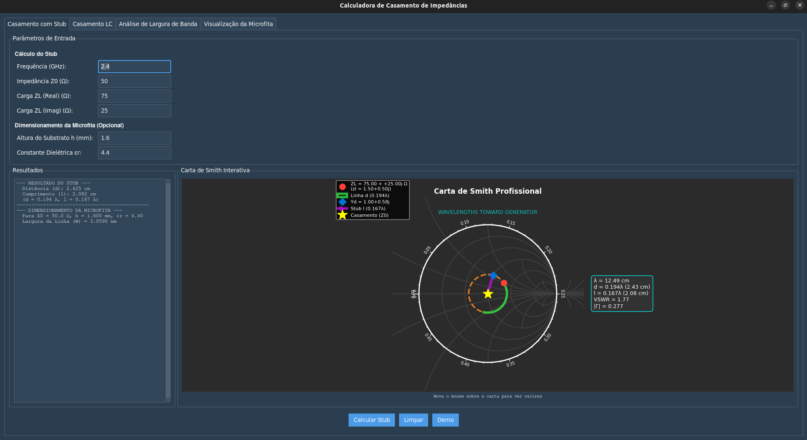
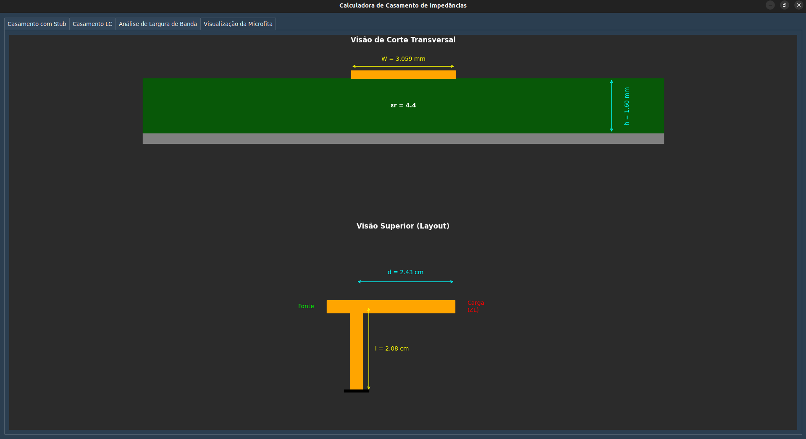
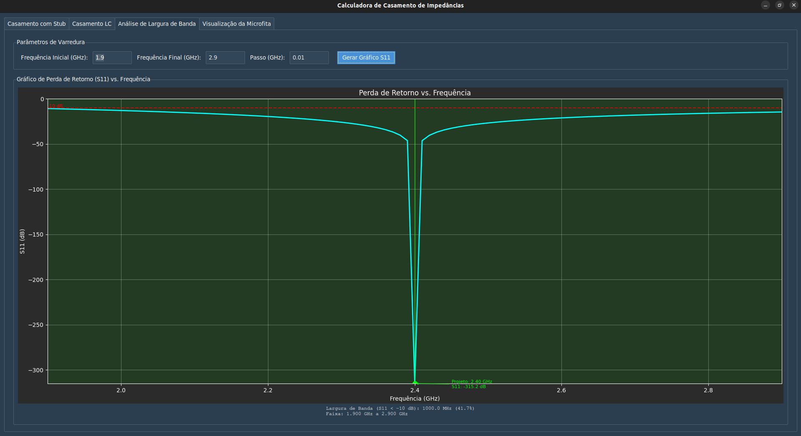

# Calculadora de Casamento (Stub, LC) com Carta de Smith Interativa

Aplicação educacional e prática para casamento de impedâncias com:
- Carta de Smith interativa
- Cálculo de stub paralelo em curto
- Redes de casamento L (LC)
- Dimensionamento de linha de microfita
- Varredura de S11 (largura de banda)
- Visualização do layout e corte da microfita

## Docs

<div align="center">
  
  
  

</div>


## Requisitos
- Python 3.8+
- Dependências:
  - tkinter (já incluído no Python; no Linux pode exigir pacote do sistema)
  - ttkbootstrap
  - numpy
  - matplotlib

No Linux (Ubuntu/Debian), instale Tk caso necessário:
```bash
sudo apt-get update && sudo apt-get install -y python3-tk
```

## Instalação (dev) — Passos rápidos
Windows (PowerShell):
```powershell
python -m venv .venv
.venv\Scripts\activate
pip install -r requirements.txt
```

Linux/macOS (bash):
```bash
python3 -m venv .venv
source .venv/bin/activate
pip install -r requirements.txt
```

Ou usando Makefile (Linux/macOS):
```bash
make install
```

## Execução (dev)
```bash
python magrf.py
# ou
make run
```

## Binários prontos (Downloads)
- Via GitHub Actions (Artifacts):
  - Ao criar uma tag `vX.Y.Z` ou rodar o workflow manualmente, a CI publica artifacts com os binários:
    - Windows: `calculadora-casamento-windows` (contém o `.exe` em `dist/`)
    - Linux: `calculadora-casamento-linux` (pasta onedir em `dist/calculadora-casamento/`)

## Compilação/Empacotamento
Este projeto inclui um Makefile com alvos úteis:

- make install — prepara o ambiente (venv + dependências)
- make run — executa a aplicação (GUI)
- make build — Linux onefile (pode falhar em algumas distros devido a libpython)
- make build-linux — Linux onedir (recomendado; mais robusto)
- make build-linux-onefile — Linux onefile com coleções extras (tentativa)
- make clean — remove artefatos (`build/`, `dist/`, `*.spec`, `__pycache__`)

Notas:
- Saída Linux (onedir): `dist/calculadora-casamento/` contendo o executável `calculadora-casamento`
- Saída Linux (onefile): `dist/calculadora-casamento` (único binário)
- Windows: gere pelo workflow do GitHub ou numa máquina Windows (ver abaixo)

### Build no Windows
Opções:
1) GitHub Actions (recomendado):
   - Workflow em `.github/workflows/build.yml`
   - Disparo por tag `v*.*.*` (ex.: `v1.0.2`) ou manual (Actions > Run workflow)
   - Artifacts publicados com o `.exe` dentro de `dist/`
2) Localmente no Windows (PowerShell):
```powershell
py -m venv .venv
.venv\Scripts\pip install -r requirements.txt pyinstaller pyinstaller-hooks-contrib
.venv\Scripts\pyinstaller --noconfirm --onefile --windowed --collect-all matplotlib --collect-all ttkbootstrap --hidden-import PIL._tkinter_finder --name calculadora-casamento magrf.py
```

## Como Usar

A interface possui 4 abas principais.

1) Casamento com Stub
- Entradas:
  - Frequência (GHz)
  - Z0 (Ω)
  - ZL (Real) (Ω)
  - ZL (Imag) (Ω)
  - (Opcional) Altura do substrato h (mm) e εr para microfita
- Botões:
  - Calcular Stub: executa o cálculo e plota na Carta de Smith
  - Limpar: limpa campos e gráficos
  - Demo: preenche valores de exemplo
- Saídas:
  - Distância d e comprimento l do stub (em cm e frações de λ)
  - Carta de Smith com:
    - Ponto da carga (ZL)
    - Círculo de VSWR
    - Rotação ao longo da linha (d)
    - Conversão para admitância
    - Efeito do stub até o centro (casamento)
  - Dica: passe o mouse sobre a carta para ver Γ, Z e Y no rodapé

2) Casamento LC
- Entradas: Frequência (GHz), Z0 (Ω), ZL (Real/Imag) (Ω)
- Ações:
  - Calcular Redes LC: lista todas as soluções L-match possíveis
  - Para cada solução, use “Plotar & Ver Solução” para visualizar:
    - Trajetória na Carta de Smith
    - Diagrama esquemático (série/shunt, C/L) com valores
- Observação: a ordem da topologia é “Componente próximo à carga, Componente próximo à fonte”

3) Análise de Largura de Banda
- Requer uma solução de stub calculada
- Entradas:
  - Frequência inicial/final (GHz) e passo (GHz)
- Saídas:
  - Curva S11(dB) vs. frequência
  - Linha de -10 dB e destaque da faixa que satisfaz S11 < -10 dB
  - Marca da frequência de projeto

4) Visualização da Microfita
- Mostra:
  - Corte transversal (substrato, faixa condutora) com h e W
  - Visão superior (linha principal, stub e curto)
- Requer:
  - h (mm) e εr preenchidos
  - Uma solução de stub válida (usa d e l)

## Unidades e Convenções
- Frequência: GHz
- Impedâncias: Ω
- d, l: exibidos em cm e frações de λ
- Microfita:
  - Entrada: h (mm), εr (adimensional)
  - Saída: W (mm)
- Carta de Smith usa impedâncias normalizadas por Z0

## Exemplo Rápido (Demo)
1) Clique em “Demo”
2) Clique em “Calcular Stub”
3) Explore a Carta de Smith e, se desejar, vá à aba “Análise de Largura de Banda” e gere o S11
4) Preencha h=1.6 e εr=4.4 para ver a visualização da microfita

## Notas de Modelagem
- Stub e linha: modelo ideal, sem perdas
- Microfita: aproximação clássica (ex.: Hammerstad-Jensen) para W; resultados são aproximações
- LC: elementos ideais (L, C), sem parasitas; podem existir múltiplas soluções para o mesmo caso

## Solução de Problemas
- Tk/TkAgg: instale o Tk (Linux): `sudo apt-get install python3-tk`
- Campos numéricos: use ponto “.” como separador decimal
- S11 não plota: calcule o stub primeiro na aba principal
- PyInstaller (Linux onefile): se falhar com libpython faltando, prefira `make build-linux` (onedir)
- Pillow/Tk no bundle: usamos `--hidden-import PIL._tkinter_finder` para evitar erros `PyImagingPhoto`

## Estrutura do Projeto
- `magrf.py` — aplicação principal (GUI)
- `requirements.txt` — dependências
- `Makefile` — tarefas de build/execução
- `.github/workflows/build.yml` — CI para gerar binários (Linux/Windows)

## Publicação no GitHub (passos sugeridos)
1. Iniciar repositório e primeiro commit:
```bash
git init
git add .
git commit -m "chore: initial commit"
git branch -M main
```
2. Crie um repositório no GitHub e copie a URL (ex.: `https://github.com/<user>/<repo>.git`)
3. Vincule e envie:
```bash
git remote add origin <URL>
git push -u origin main
```
4. Releases/Artifacts:
```bash
git tag vX.Y.Z
git push origin vX.Y.Z
```

## Contribuição
- Issues e PRs são bem-vindos. Sugestões de funcionalidades e correções de bugs ajudam o projeto.

## Licença
- Defina uma licença (ex.: MIT) e inclua um arquivo `LICENSE` no repositório.
